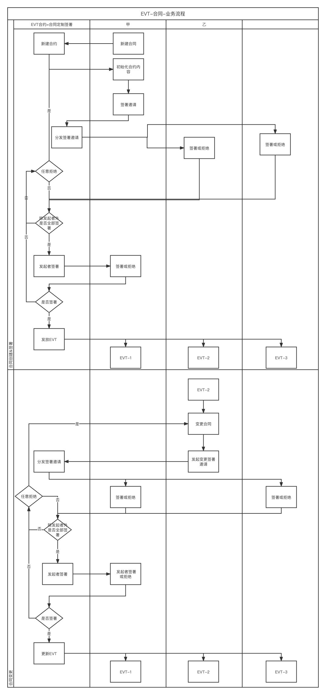

背景：

- Workshop中提出EVT实现方向：EVT能否用于合同签署

方案简述：

- EVT合约=合同定制签署
  - ETV-Token=合同的备份不可转让（属性可在规定流程中操作）
- EVT合约=印章制作（可选）
  - ​	印章ETV-Token：与地址绑定不可转让、部分内容可变、部分内容不可变、可新增、可作废

业务简述：

- 创建合同：甲-初始化合同内容（新建合约）并发起签署邀请
  - If：任意被邀请人拒绝，返回给发起人重新发起；
  - if：被邀请人全部同意，返回给发起人确认，发起人确认无问题并签署后发放EVT，如有问题发起人可以编辑后重新发起邀请
- 变更合同：任意人编辑合同信息后发起更变更签署邀请
  - If：任意被邀请人拒绝，返回给发起人重新发起；
  - if：被邀请人全部同意，返回给发起人确认，发起人确认无问题并签署后发放EVT，如有问题发起人可以编辑后重新发起邀请

业务流程图：

